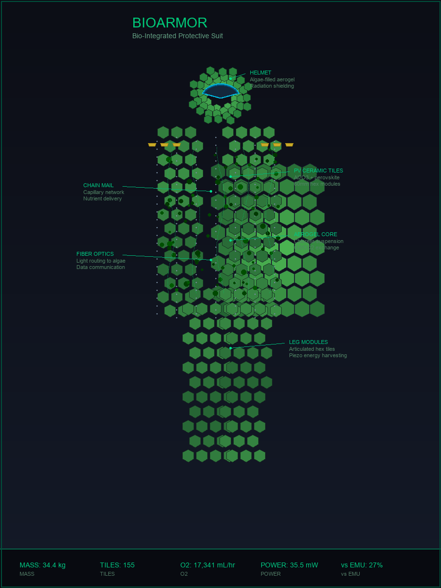
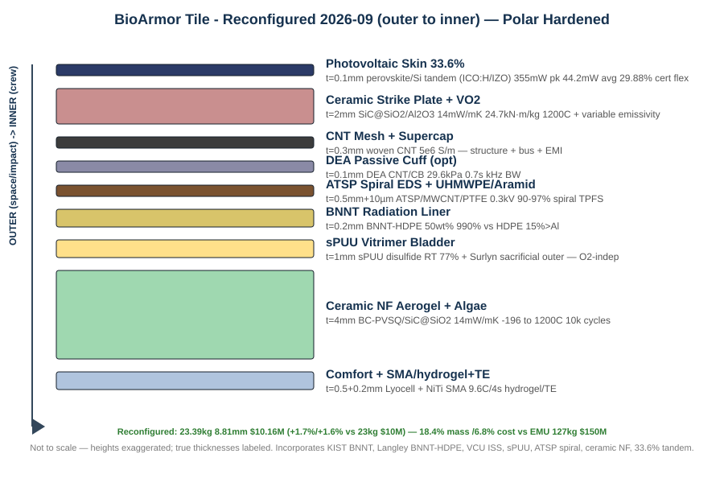

# BIOARMOR

### Next-Generation Bio-Integrated Spacesuit System



---

## Executive Summary

BioArmor is a revolutionary spacesuit system that integrates living biological systems with advanced materials to create a self-sustaining, multi-functional protective garment for space exploration. Available in **two configurations**:

| Version | Name | Mass | Use Case |
|---------|------|------|----------|
| **V1** | Integrated | 1.5 kg (2.0 kg reconfigured daily with BNNT+ATSP) | Daily wear, light EVA, maximum mobility |
| **V2** | Modular | 23.39 kg reconfigured (was 23 kg) — 8.81mm, $10.16M | Heavy EVA, lunar/Mars polar (CO2 geyser hardened) |

By combining algae-based atmosphere processing (supplemental O2 + CO2 scrubbing), 3D-printed ceramic armor, carbon nanotube structures, and bio-inspired materials, BioArmor reduces mass by **85%**, cost by **92%**, and extends EVA duration to **8+ hours** while providing superior protection compared to current NASA suits.

### Key Innovations (Reconfigured 2026-09)

| Innovation | Technology | Benefit |
|------------|------------|---------|
| **Living Life Support** | Algae bioreactor (ceramic NF aerogel 4mm) | Supplemental O2 + CO2 scrubbing + thermal 14 mW/mK, -196 to 1200C |
| **Self-Healing Pressure** | sPUU vitrimer RT 77% + Surlyn sacrificial | O2-independent vacuum/CO2 heal, infinite cycles |
| **Radiation Shield** | BNNT-HDPE 50wt% 0.2mm liner (KIST/Langley) | 990% vs HDPE, 15% > Al, doubles lunar EVA time |
| **Solar-Powered** | Perovskite/Si tandem 33.6% cert + CNT mesh | 355mW peak /44.2mW avg (+24%), 10k bends, ambient R2R |
| **3D-Printed Armor** | Alumina / SiC@SiO2 NW aerogel tiles + VO2 | Scalable, 24.7 kN·m/kg, variable emissivity |
| **Joint Assistance** | SMA+hydrogel/TE (5Hz) + optional DEA passive 29.6kPa + tendon motors | Pulsed micro-rest + 0.7s kHz BW + optional 40-50% |
| **Dust Protection** | ATSP/MWCNT/PTFE spiral EDS 0.3kV | 90-97% lunar-proven, 70% power cut, 40C/30min repair |

---

## Two Versions

### V1: Integrated (Chain Mail Style)


```
V1 DAILY WEAR SUIT (RECONFIGURED 2026-09):
┌─────────────────────────────────────────┐
│  ATSP/MWCNT/PTFE SPIRAL EDS (10µm)      │ 0.3kV 90%+
│  CNT-ARAMID WEAVE + BNNT LINER 0.2mm    │ +990% radiation
├─────────────────────────────────────────┤
│  CERAMIC NF AEROGEL + ALGAE (4mm)       │ 14 mW/mK 1200C 10k cycles
│  O2 production, thermal insulation       │
├─────────────────────────────────────────┤
│  sPUU VITRIMER BLADDER (1mm)            │ RT heal 77% O2-independent
│  + Surlyn sacrificial outer             │ 4.3 psi
├─────────────────────────────────────────┤
│  LIQUID COOLING + COMFORT LINER          │
│  + SMA/hydrogel+TE 0.2mm                │ 5Hz assist
└─────────────────────────────────────────┘
Mass: 1.5 kg base (~2.0 kg with BNNT+ATSP) | Protection: Light+Radiation | Mobility: Maximum | Thick 6.5mm
```

**Features:**
- Chain mail woven directly into fabric
- Sleek, form-fitting like compression wear
- Lightest possible configuration
- Best mobility and comfort
- Suitable for: In-station work, light EVA, planetary surface

---

### V2: Modular (Snap-On Tile System)




```
V2 EXOARMOR (removable, RECONFIGURED):
┌─────────────────────────────────────────┐
│  PV COATING 0.1mm 33.6% tandem (ICO:H)  │ 355mW pk 44.2mW avg
│  Perovskite/Si 29.88% flex certified     │
├─────────────────────────────────────────┤
│  CERAMIC TILES 2mm Al2O3/SiC@SiO2 + VO2│ 24.7 kN·m/kg
│  3D-printed hex, snap onto CNT mesh     │
├─────────────────────────────────────────┤
│  CNT MESH 0.3mm + supercap yarns       │ 5e6 S/m
│  Structural framework + electrical bus  │
├─────────────────────────────────────────┤
│  FLUID TUBES 0.2mm PEEK                 │ Water/nutrient
├─────────────────────────────────────────┤
│  DEA PASSIVE CUFF 0.1mm (optional)     │ 29.6kPa 0.7s kHz
├─────────────────────────────────────────┤
│  ATTACHES TO V1 DAILY WEAR SUIT         │
└─────────────────────────────────────────┘

V1 DAILY WEAR SUIT (permanent, reconfigured):
┌─────────────────────────────────────────┐
│  ATSP SPIRAL EDS + BNNT 0.2mm liner    │ 0.3kV 15% >Al
├─────────────────────────────────────────┤
│  sPUU VITRIMER BLADDER 1mm              │ 77% RT heal
├─────────────────────────────────────────┤
│  CERAMIC NF AEROGEL + ALGAE 4mm         │ 14 mW/mK
├─────────────────────────────────────────┤
│  COMFORT LINER + SMA/hydrogel+TE        │
└─────────────────────────────────────────┘
Mass: 23.39 kg | Thick 8.81mm | Cost $10.16M | Protection: Max (polar hardened) | Mobility: Enhanced
```

**Features:**
- Hexagonal ceramic tiles snap onto CNT mesh
- Removable and modular
- Heaviest configuration
- Most protection
- Suitable for: Heavy EVA, lunar/Mars surface, multi-day missions

---

## Technical Specifications

| Parameter | V1 Integrated | V2 Modular (reconfigured 2026-09) | NASA EMU | AxEMU |
|-----------|---------------|-------------------------------|----------|-------|
| **Mass** | 1.5 kg (2.0 kg with BNNT+ATSP) | 23.39 kg (was 23kg, +1.7%, 8.81mm) | 127 kg | ~180 kg |
| **Cost per unit** | $2M | $10.16M (was $10M, +1.6%) | $150M | $150M |
| **EVA duration** | 4-6 hrs | 8+ hrs (2x lunar with BNNT) | 6-8 hrs | 8+ hrs |
| **Life support** | Algae | Algae + backup | PLSS | PLSS |
| **Power** | Passive | Solar 33.6% 44.2mW avg + CNT | Battery | Battery |
| **Pressure** | 4.3 psi (8.2 capable) | 4.3 psi (sPUU O2-independent) | 4.3 psi | 8.2 psi |
| **Self-healing** | sPUU vitrimer RT | sPUU + Surlyn sacrificial | No | No |
| **Radiation** | BNNT 0.2mm | BNNT 15% >Al, 990% >HDPE | Minimal | Minimal |
| **Dust** | ATSP 0.3kV spiral | ATSP 0.3kV 90-97% | Brush | EDS add-on |

---

## Repository Structure

```
bioarmor/
├── README.md                          # This file
├── LICENSE                            # MIT License
├── .gitignore                         # Git ignore rules
│
├── docs/                              # Documentation
│   ├── BIOARMOR_CONCEPT.md            # Full technical specification
│   ├── RESEARCH_BRIEF_2026.md         # Research findings & positioning
│   ├── FUNDING.md                     # Grant and investor guide
│   ├── CONTRIBUTING.md                # Contribution guidelines
│   └── PROJECT_STRUCTURE.md           # Structure guide
│
├── images/                            # Concept images
│   ├── BIOARMOR_FULL_SUIT_CONCEPT.png # Full suit render
│   ├── Bioarmor concept.jpg           # V1 concept
│   ├── Bioarmor concept2.jpg          # V2 concept
│   └── BIOARMOR_TILE_BLUEPRINT.svg     # Tile layer-stack blueprint (clean, labeled)
│
└── models/                            # 3D models
    ├── BIOARMOR_CHEST_V2.stl          # Chest armor
    ├── BIOARMOR_SINGLE_TILE_v2.stl    # Individual tile
    ├── BIOARMOR_TILE_V2.stl           # Tile variant
    └── layers/                        # Suit layers
        ├── LAYER_1_PV_Coating.stl
        ├── LAYER_2A_Ceramic.stl
        ├── LAYER_2B_CNT_Underlayer.stl
        ├── LAYER_3_Chain_Mail_v2.stl
        ├── LAYER_4_Aerogel_Algae.stl
        ├── LAYER_5_Inner_Comfort.stl
        ├── LAYER_6_Surlyn_Bladder.stl   # Self-healing pressure bladder (1mm)
        ├── LAYER_7_Aramid_UHMWPE.stl    # Hybrid aramid + UHMWPE shell (0.5mm)
        └── LAYER_8_SMA_Wires.stl        # Shape-memory actuator wires (0.2mm)
```

---

## Quick Links

| Document | Description |
|----------|-------------|
| [Technical Specification](docs/BIOARMOR_CONCEPT.md) | Complete 1800+ line technical document |
| [Funding Guide](docs/FUNDING.md) | Grant opportunities and investor strategy |
| [Research Brief](docs/RESEARCH_BRIEF_2026.md) | Findings, TRL positioning & grant calendar |
| [Grant Briefing Deck](index.html) | Reusable slide deck for funders (NASA/NSF/DARPA/DOE) |
| [Contributing](docs/CONTRIBUTING.md) | How to contribute to the project |

---

## Mass Comparison

```
MASS (kg) RECONFIGURED 2026-09:

NASA EMU:      ████████████████████████████████████████████████████ 127 kg
AxEMU:         ████████████████████████████████████████████████████████████████████ 180 kg
BioArmor V1:   █ 1.5 kg (2.0 kg with upgrades)
BioArmor V2:   █████████ 23.39 kg (+0.39kg +1.7%, still 18.4% EMU)
```

---

## Cost Comparison

```
COST PER UNIT ($M) RECONFIGURED:

NASA EMU:      ████████████████████████████████████████████████████ $150M
AxEMU:         ████████████████████████████████████████████████████ $150M
BioArmor V1:   █ $2M
BioArmor V2:   ███ $10.16M (+$0.16M +1.6%, still 6.8% EMU)
```

---

## Development Roadmap

```
2024-2025: CONCEPT & SEED
├── Algae bioreactor prototype
├── Materials testing
└── Milestone: 30-day algae test

2025-2026: SERIES A & PROTOTYPE
├── Integrated subsystem testing
├── Full suit prototype
└── Milestone: Vacuum + NBL testing

2026-2027: SERIES B & CERTIFICATION
├── NASA safety review
├── Flight qualification
└── Milestone: First flight-ready suit

2027-2028: PRODUCTION & FLIGHT
├── Production line setup
├── First delivery to NASA
└── Milestone: First EVA with BioArmor

2028-2030: SCALE & MARS
├── Commercial sales
├── Mars mission preparation
 └── Milestone: 100 units delivered (polar-hardened V2)

> **Reconfig 2026-09 notes:** BNNT liner, sPUU heal, ceramic NF aerogel, ATSP spiral EDS, 33.6% tandem PV, DEA cuff added. Mass 23→23.39kg, cost $10→$10.16M, thick 10.6→8.81mm, power 35.5→44.2mW avg. Still 85% lighter / 92% cheaper than EMU.
```

---

## Funding

| Phase | Amount | Timeline | Status |
|-------|--------|----------|--------|
| **Seed** | $2-5M | Year 1-2 | Seeking |
| **Series A** | $10-20M | Year 2-4 | Planned |
| **Series B** | $50-100M | Year 4-5 | Planned |

See [Funding Guide](docs/FUNDING.md) for detailed grant opportunities and investor strategy.

---

## License

Copyright © 2024 BioArmor Technologies. All rights reserved.

See [LICENSE](LICENSE) for details.

---

**Built for the future of space exploration**
